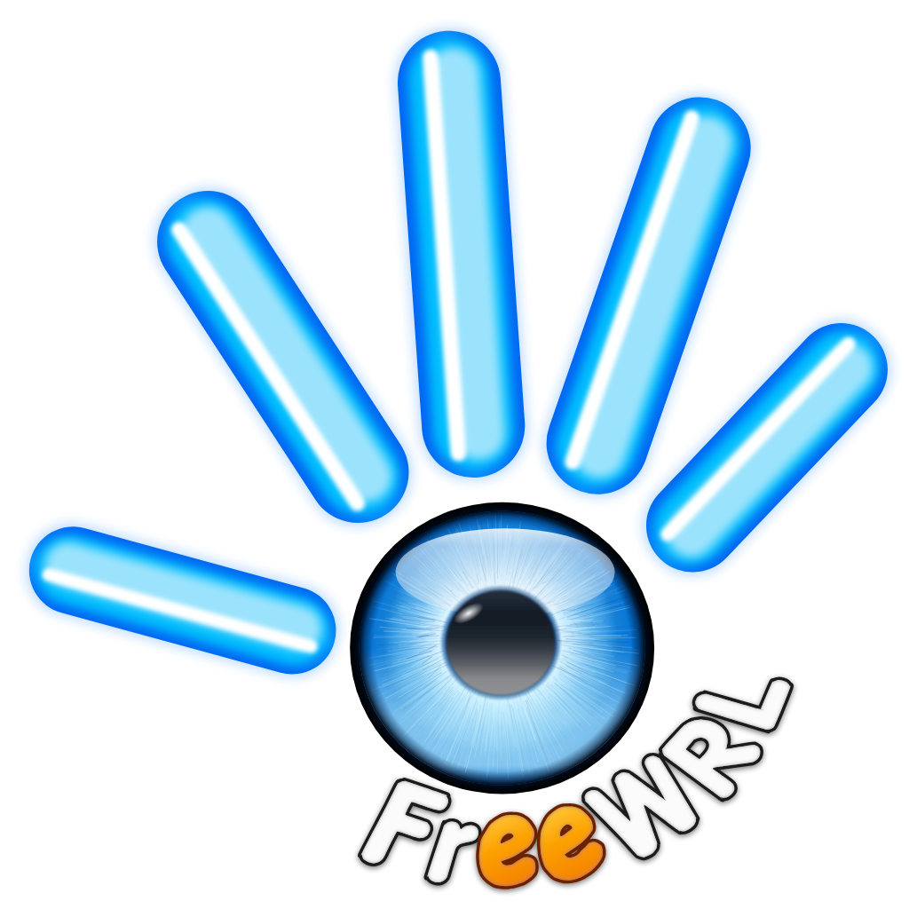

<p align="center">
  
</p>

# FreeWRL

<p align="center">
  <a href="#version"></a>
  <a href="#supported-formats"></a>
  <a href="#macos-apple-silicon-status"></a>
  <a href="#license-and-attribution"></a>
  <a href="#fork-notice"></a>
</p>

FreeWRL is an open-source X3D and VRML97 browser written in C. It runs as a
standalone application, as a browser plugin, or as an embeddable library
(`libFreeWRL`), with JavaScript Script nodes, EAI/SAI, and a mix of desktop
and mobile platform targets.

## Fork notice

**This repository is not the official FreeWRL project.**

- **Original project.** FreeWRL is the original open-source VRML97/X3D
  browser hosted on SourceForge: <https://sourceforge.net/projects/freewrl/>.
  FreeWRL was written by its original authors and contributors, who retain
  their copyrights.
- **This repository.** This GitHub repository is the Ascendance Open Worlds
  modernization fork of FreeWRL, maintained by Ryan Bundy (DJAscendance). It
  is not the official upstream.
- **Current modernization.** The fork is restoring modern platform support,
  starting with native Apple Silicon macOS support for the FreeWRL 6.7 code
  line.

Bugs in FreeWRL itself belong upstream. Issues specific to the changes in
this fork belong on this repository.

## Current fork status

| Branch | What it is |
| --- | --- |
| `master` | The single canonical maintained trunk: the Ascendance Open Worlds FreeWRL 6.7 modernization line, including native Apple Silicon macOS support and this fork's merged work. All new work branches from `master` and merges back to `master`. It is the branch GitHub visitors see first. Before the 2026-09 promotion, `master` was an exact mirror of upstream `master` at `e99ab4a00` (2020-02-21); that commit remains the historical baseline. |
| `develop` | Retired. It was the integration branch (based on upstream SourceForge `develop` at `b3254b11e`, "Version 6.7", 2024-04-20) whose tested state was promoted to `master` in 2026-09; it is no longer part of the workflow. |
| `macos-arm64-develop-port` | The Apple Silicon port of FreeWRL 6.7, merged into `develop` through [pull request #2](https://github.com/Ascendance3D/freewrl/pull/2). |
| `macos-arm64` | An earlier Mac port of the 2020 `master` line, kept for reference. |

## Version

This fork's maintained `master` trunk is based on FreeWRL 6.7:

- SourceForge `develop` commit `b3254b11e`, the upstream base of this
  fork's 6.7 line, is titled `Version 6.7`.
- `freex3d/src/buildversion.h` reports version `6.7.0`.
- The Linux autotools build reports `6.7.0` too: `freex3d/versions/FREEWRL`
  (program), `freex3d/versions/LIBFREEWRL` (library) and `AC_INIT` in
  `freex3d/configure.ac` (package and `libFreeWRL.pc`).

## Supported formats

- VRML97 (`.wrl`, classic encoding), including gzipped files
- X3D XML encoding (`.x3d`)
- X3D classic VRML encoding (`.x3dv`)
- Collada and STL import (partial)
- Textures: JPEG, PNG, GIF
- Resources loaded from local files or over HTTP(S)

## macOS Apple Silicon status

**Native Apple Silicon macOS source support is available on this fork's
maintained `master` trunk.** It was
reviewed and merged into the 6.7 integration line through
[pull request #2](https://github.com/Ascendance3D/freewrl/pull/2) (the original
FreeWRL 6.7 Apple Silicon integration) and promoted to `master` through
[pull request #7](https://github.com/Ascendance3D/freewrl/pull/7).

- Supported target: **macOS 15 Sequoia and newer on Apple Silicon (arm64).**
  Intel and macOS 14 or older are not release targets.
- Release and Debug arm64 builds pass with Xcode. The only non-Apple libraries
  linked are FreeType, ODE and freealut (audio uses Apple's `OpenAL.framework`);
  textures are decoded by the bundled stb_image, not Imlib2.
- FreeWRL runs on an OpenGL 4.1 core context on Apple Silicon (the highest
  version macOS offers). Rendering still uses OpenGL; there is no Metal
  renderer.
- Retina interaction has been tested: keyboard hotkeys including `q` quit,
  held-key navigation, mouse picking, HUD clicks, and sensor drag.
- VRML97 and X3D rendering tests and the Cybertown tests passed.
- The packaging tooling (`tools/macos-deps/build.sh`,
  `tools/macos-package/package.sh`) is complete and tested: it builds a
  self-contained, Developer ID-signed, hardened-runtime, notarizable
  `FreeWRL.app` that runs on macOS 15+ with no Homebrew, Imlib2, FFmpeg or
  OpenAL Soft at run time.
- Two macOS prereleases are published on GitHub Releases:
  `v6.7.0-macos-beta.1` and `v6.7.0-macos-beta.2`. Their release notes state
  that the app is Developer ID signed and Apple notarized.

Current QA: the release line is the merged `master` trunk. Pull requests are
tested locally before they merge: on Ubuntu 24.04 x86_64, and on a physical
Apple Silicon Mac for changes that can affect macOS. The latest merge,
[pull request #47](https://github.com/Ascendance3D/freewrl/pull/47), passed
both. The first maintained desktop release is `v6.7.0`, for
macOS Apple Silicon and Ubuntu/Linux; [`RELEASING.md`](RELEASING.md) gives
the release procedure and its validation gates. The manual interaction
checks are recorded in
[`docs/MANUAL-INTERACTION-CHECKLIST.md`](docs/MANUAL-INTERACTION-CHECKLIST.md).
The Apple Silicon port review history is on
[pull request #2](https://github.com/Ascendance3D/freewrl/pull/2).

Detailed engineering status, per-feature evidence, and the OpenGL
compatibility layer are in [`MACOS-STATUS.md`](MACOS-STATUS.md).

## Build instructions

### Linux (autotools)

```sh
cd freex3d
./autogen.sh
./configure --help        # review the available options
./configure --with-target=x11 --with-javascript=duk
make
sudo make install
```

Useful options include `--with-target` (`x11`, `motif`), `--with-javascript`
(`duk` for the bundled duktape, `sm` for SpiderMonkey, `stub` for none),
`--enable-libeai`, and `--enable-debug`.

A git checkout does not contain the Autotools outputs (`configure`,
`config.h.in`, the automake `Makefile.in` files, `INSTALL`, `doc/doxyfile`).
Run `./autogen.sh` to make them. `src/libnurbs/Makefile.in` and
`src/libtess/Makefile.in` are hand-written and tracked. A source archive from
`make dist` contains all generated files and builds with `./configure && make`
without `autogen.sh`.

Linux configuration status (checked on Ubuntu 24.04):

| Configuration | Status |
|---|---|
| `--with-target=x11 --with-javascript=duk` | Supported and tested: build, `make distcheck`, install, runtime |
| `--with-target=motif --with-javascript=duk` | Supported and tested: build, install, runtime. Needs `libmotif-dev` |
| `--with-javascript=stub` | Builds and runs; Script nodes do not run |
| `--with-javascript=sm` | Legacy. The code uses the SpiderMonkey 1.8.5–24 API (`JSRuntime`). `configure` looks only for `mozjs-24`, `mozjs-17.0`, `mozjs187`, `mozjs185` or `mozilla-js` < 3.0. Current distributions do not package these, so `configure` stops with an error |
| `--enable-plugin` (default on) | Legacy. The plugin uses NPAPI, which current browsers removed. `configure` finds no NPAPI SDK, warns and does not build the plugin |

### macOS (Apple Silicon)

Supported: macOS 15 Sequoia and newer on Apple Silicon (arm64). Build from the
maintained `master` branch. The Xcode project links only FreeType, ODE and
freealut (Apple's `OpenAL.framework` for audio); `FW_DEPS` tells Xcode where to
find them:

```sh
git checkout master
tools/macos-deps/build.sh -p ~/freewrl-deps   # FreeType, ODE, freealut from pinned sources, for macOS 15
cd OSX_gui/FreeWRL-Desktop
xcodebuild -project FreeWRL.xcodeproj -scheme FreeWRL \
  -configuration Release ARCHS=arm64 CODE_SIGN_IDENTITY=- FW_DEPS=$HOME/freewrl-deps build
```

For a self-contained, signable app bundle, run
`tools/macos-package/package.sh -D ~/freewrl-deps -z`
(see [`tools/macos-package/README.md`](tools/macos-package/README.md)).
For local development you can instead point `FW_DEPS` at a Homebrew prefix with
`freetype ode freealut` installed, but a Homebrew-linked build is not
distributable. All development happens on `master`; start a short task branch
from it (`git checkout master`).

### Windows

Visual Studio 2022 projects are in `freex3d/projectfiles_2022/` (and older
`projectfiles_vc7/`). They have not been changed by this fork.

### Trying it

```sh
freewrl freewrl/tests/1.wrl
```

The numbered worlds in `freewrl/tests/` are described in
`freewrl/tests/README`.

## Original SourceForge project

- Project page: <https://sourceforge.net/projects/freewrl/>
- Source repository: <https://sourceforge.net/p/freewrl/git/>
- Clone: `git clone https://git.code.sf.net/p/freewrl/git freewrl`

## Ryan's SourceForge fork

- <https://sourceforge.net/u/djascendance/freewrl/>
- Clone: `git clone https://git.code.sf.net/u/djascendance/freewrl`

## GitHub mirror and fork

- <https://github.com/Ascendance3D/freewrl>
- Pull requests here are how fork changes are reviewed before they are
  offered upstream.

## Repository layout

| Path | Contents |
| --- | --- |
| `freex3d/` | Core engine source (`src/lib`), standalone executable (`src/bin`), autotools build, code generator (`codegen/`), icons |
| `OSX_gui/` | Xcode projects for macOS desktop (the iOS project is historical and unsupported) |
| `freex3d/projectfiles_*` | Visual Studio projects for Windows |
| `Android/` | Historical Android NDK build (unsupported) |
| `linux_appimage/` | Scripts that bundle an installed FreeWRL into an AppImage |
| `freewrl/tests/` | Numbered sample VRML/X3D worlds |
| `SoundEngine/` | Separate sound engine |
| `docs/` | Fork documentation and web images |

## Known limitations

On macOS:

- OpenGL stops at version 4.1, and Apple has deprecated OpenGL.
- HAnim uses CPU skinning; GPU skinning needs features newer than GL 4.1.
- Lines are always drawn one pixel wide.
- TIFF and WebP textures are not decoded (stb_image has no decoder for them);
  such a texture is drawn untextured.
- The draft release workflow (`.github/workflows/release-macos.yml`) can
  build an ad-hoc package, but the `v6.7.0` release plan requires the final
  macOS asset to be Developer ID signed, hardened-runtime enabled, notarized,
  and stapled before publication. The signed package is built locally with
  `tools/macos-package/package.sh -s … -r --notarize`; see
  [`RELEASING.md`](RELEASING.md).

Known FreeWRL 6.7 defects, present upstream and not introduced by the port:

- `GeneratedCubeMapTexture` renders a black reflection.
- `ComposedCubeMapTexture` casts a field to the wrong node structure.
- Directional-light shadows darken areas outside the shadow map.
- `HAnimHumanoid` ignores its own transform fields.

## Contributing

1. `master` is the single canonical maintained trunk (no longer the old
   2020 line); base all new work on it.
2. Branch a short `feature-*` or `fix-*` task branch from `master`, open a
   pull request against `master`, and delete the task branch after it merges.
3. Keep every platform compiling; much of the code is conditional on
   platform defines.
4. Node definitions are generated: edit `freex3d/codegen/*.pm` and run
   `perl VRMLC.pm` from `freex3d/codegen/` rather than editing the generated
   files.
5. Fixes to FreeWRL itself are welcome upstream too, on the SourceForge
   project.

The full guide is in [`CONTRIBUTING.md`](CONTRIBUTING.md). Report
vulnerabilities privately as [`SECURITY.md`](SECURITY.md) describes, not in a
public issue. For help, see [`SUPPORT.md`](SUPPORT.md). Everyone who takes part
follows the [Code of Conduct](CODE_OF_CONDUCT.md).

## License and attribution

FreeWRL was written by its original authors and the FreeWRL/FreeX3D
contributors, who retain their copyrights. Most source files carry the
notice "Copyright 2009 CRC Canada"; some files name other copyright holders.

The source headers license FreeWRL under the GNU Lesser General Public
License, version 3 or (at your option) any later version. The repository
ships the LGPL v3 text in `freex3d/COPYING.LESSER` (with an identical copy
in the root [`LICENSE`](LICENSE)) and the GNU GPL v3 text,
which the LGPL builds on, in `freex3d/COPYING`. The header boilerplate also
refers to the GPL in its warranty and "copy of the license" lines. Bundled
third-party code (for example SpiderMonkey in `freewrl/JS/`, duktape, libtess,
minizip) keeps its own license.

This fork's changes are offered under the same license. The FreeWRL logo is
the project's own artwork; see [`docs/assets/README.md`](docs/assets/README.md).
